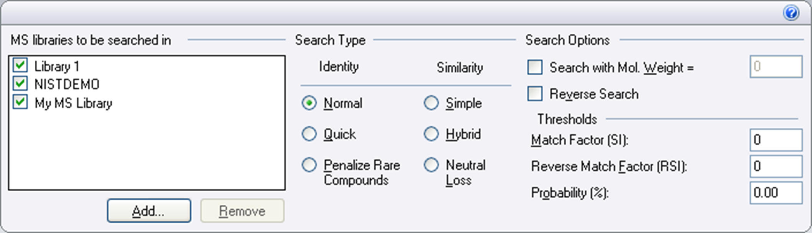

#Working with MS Libraries

## Add Spectra to an MS Library

You can add spectra from a chromatogram to a new or existing custom MS library (an MS library created in Chromeleon).

###To add spectra to a custom MS library

1.  Display a mass spectral plot in the Data Processing or Report
    Designer view.

2.  Click the plot to make it the active plot.

3.  On the Studio ribbon, under **Spectral Plot
    Tools**, click the **Library** tab.

4.  In the **Manage** group, select an existing MS
    library or create a new library (see [Create a New MS Library](#create-a-new-ms-library)). In
    the following example, spectra will be added to a library named
    `Library 1`, which currently does not
    contain any spectra.

5.  To add the spectrum currently displayed in the mass spectral plot,
    click **Add Spectrum**.

	!!! note
		If more than one spectrum is currently displayed, and if the plots are overlaid, the spectrum the mouse pointer is resting on is added. If the plots are stacked, the spectrum identified by the title on the top border of the plot is added.

6. To add the spectra of all peaks identified with a peak name in the
current chromatogram, click the down arrow and click **Add All Spectra**. For example, if there are currently
16 named peaks in the chromatogram, 16 spectra are added to the library.
The apex spectrum for each named peak is added to the library.

7. To add the spectrum of the previous or next peak from the current chromatogram, click **Previous Peak**  or **Next Peak**. The spectrum is displayed on the mass spectral plot. Verify that the plot is displaying the spectrum you want to add to the library (see Spectral Plots: Select Spectra and the guidelines below) and then click **Add Spectrum**.

Chromeleon selects the spectrum to be added as follows:

* If the apex spectrum is displayed, it is added.

* If the apex spectrum is not displayed, then the order of selection is: front 1, front 2, tail 2, tail 1. For example, if front 1 and tail 2 are displayed, front 1 is added to the library.
  
##Create a New MS Library

You can create a new MS library in the Chromatography Studio.
After creating the library, you can add spectra from a chromatogram to
the library.

###To create a new MS library

1.  Display a mass spectral plot in the Data Processing or Report
    Designer view.

2.  Click the plot to make it the active plot.

3.  On the Studio ribbon, under **Spectral Plot
    Tools**, click the **Library** tab.

4.  In the **Manage** group, click the down arrow
    and select **Create new library**.

    (In this example, the sequence already contains a library named
    PAH16.)

5.  Type the library name and click **OK**. A new
    empty MS library is created.

###Related Topics

Add Spectra to an MS Library

##Export a Spectrum to NIST MS Search

If the NIST MS Search program is installed on your computer, you can
export a spectrum from Chromeleon to the NIST program to perform a
library search.

### To export a spectrum to NIST

1.  In the Chromatography Studio, display the spectrum of interest on
    the mass spectral plot (see Select UV-Vis or Mass Spectra).

2.  Right-click anywhere on the plot and click **Export
    to NIST**.

When you select the Export to NIST command,
Chromeleon creates a temporary data file that contains spectrum
information in a text format that can be used in a NIST library search.
The NIST MS Search program opens using this temporary file.

### Related Topics

Ad Hoc Library Search

View Mass Spectral Plots

Open MS Raw Data in an External Application
  
##Find Spectra in an MS Library

You can search MS libraries for mass spectra that are similar to a
spectrum displayed on a mass spectral plot. This is referred to as an
"ad hoc" search.

!!! note
	You can also export a spectrum from Chromeleon to the NIST MS Search program, and then use the NIST program to perform a library search (see [Export a Spectrum to NIST MS Search](#export-a-spectrum-to-nist-ms-search)).

###To find spectra in an MS library

1.  Use one of the following methods to open an Ad Hoc Library Search
    window:

	*  Display the mass spectrum of interest in the Data Processing view
    (see View Mass Spectral Plots) and click the mass spectral plot to
    make it the active plot. On the Studio ribbon, under **Spectral Plot Tools**, click the **Library** tab, and then click.

    –OR–

	*  Display the mass spectrum of interest in the Data Processing view.
    Right-click the mass spectral plot and select **Find in Library**.

    –OR–

	*  On the chromatogram plot, right-click the curve at a retention time
    of interest and select **Find Spectrum in
    Library**. A retention time spectrum is created where you
    clicked and the search is performed on the spectrum.

2. After you click **Find in Library**, the Ad Hoc
Library Search window appears and displays a list of the possible
matching spectra (hits). The first spectrum listed has the highest match
and the best similarity to the original spectrum.

	!!! note
		You can also export a spectrum from Chromeleon to the NIST MS Search program, and then use the NIST program to perform a library search (see [Export a Spectrum to NIST MS Search](#export-a-spectrum-to-nist-ms-search)).

3. To modify the results, you can select different libraries and search criteria. Changes are applied immediately and the results list is updated. For details about selecting libraries and search criteria, see MS Library Screening. For details about the Ad Hoc Library Search window and the search results, see Ad Hoc Library Search.

###Related Topics

Filter the Ad Hoc Library Search Results Table

[Create a New MS Library](#create-a-new-ms-library)

[Add an MS Library](#add-ms-libraries-to-the-search-list)

Display and Overlay Retention Time Spectra from 3D or MS Data
  
##Add MS Libraries to the Search List

Any NIST 08, NIST 11, or NIST 14 format library can be included in an MS
library search, including:

-   Libraries copied from somewhere else

-   Libraries installed with the NIST MS Search program

-   Libraries created in Chromeleon (custom MS libraries)

The list in the following example contains one library of each type, in
the order described above.

###To manually add a NIST library

1.  Go to either the MS Library Screening page of the Processing Method
    Editor or the Ad Hoc Library Search window.

	-   If you want to use the library for data processing of injections in
    a sequence, go to the MS Library Screening page.

	-   If you want to use the library to search for spectrum that you
    select individually from peaks on a chromatogram plot, go to the Ad
    Hoc Library Search window.

2.  Under **MS libraries to be searched in**, click **Add** and browse to the folder that contains the NIST library. The NIST library can be located on the local PC or on a network drive. Select the library folder and click **OK**.

!!! tip
	To include a library on the MS Library Screening page and in an Ad Hoc Library Search window, add it separately to each.

###Related Topics

Ad Hoc Library Search